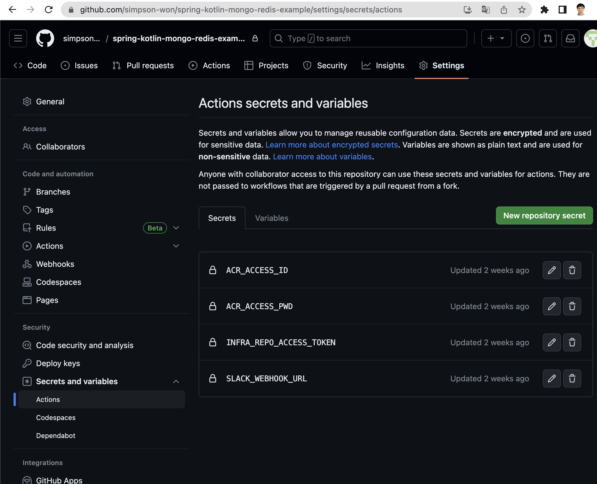
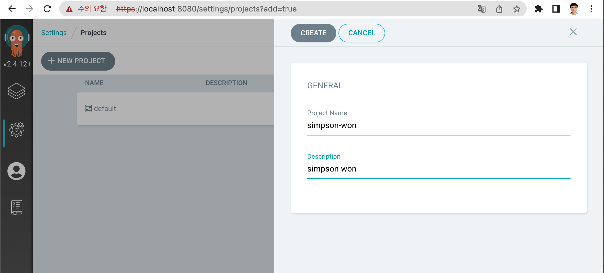
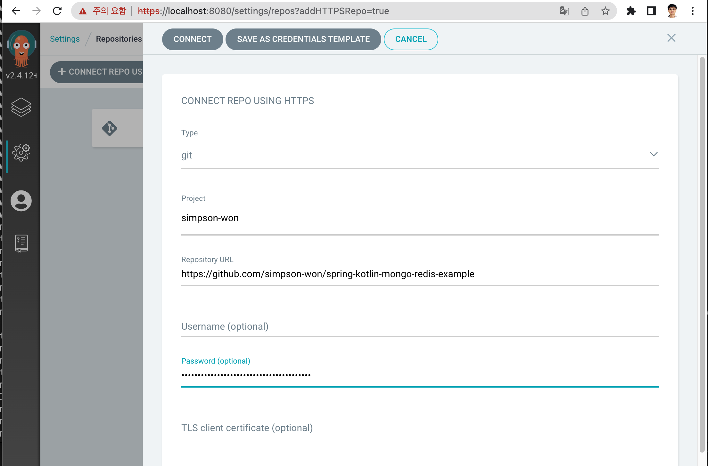
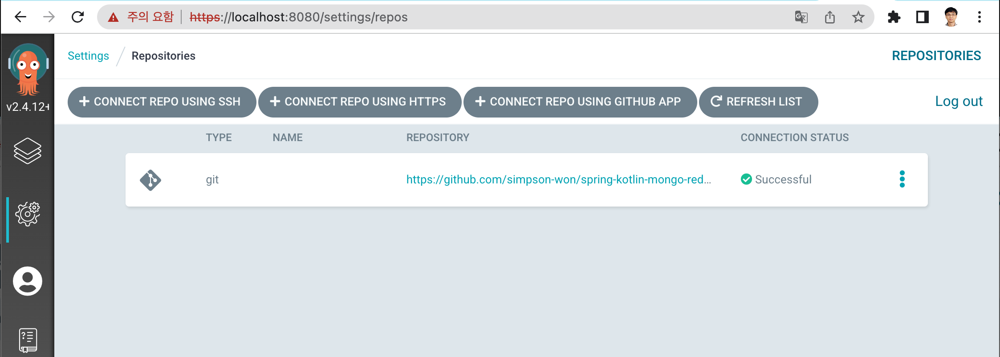
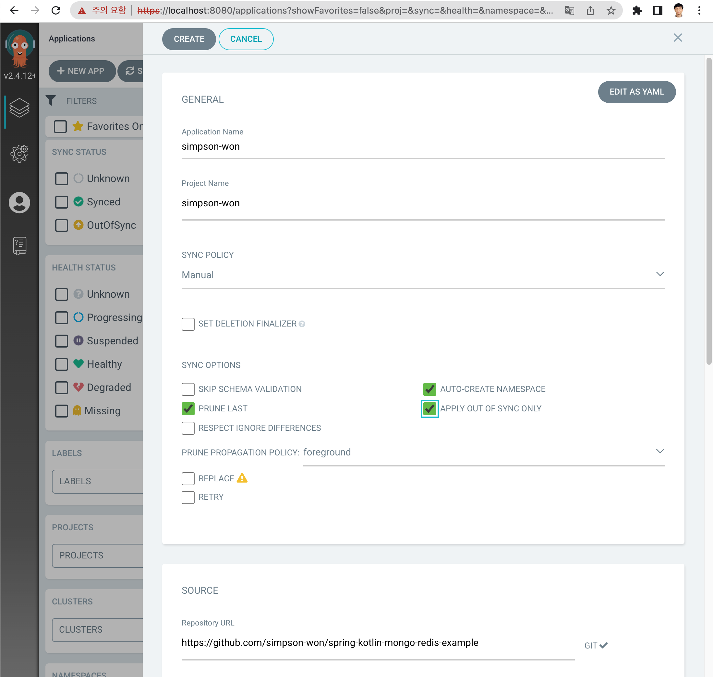
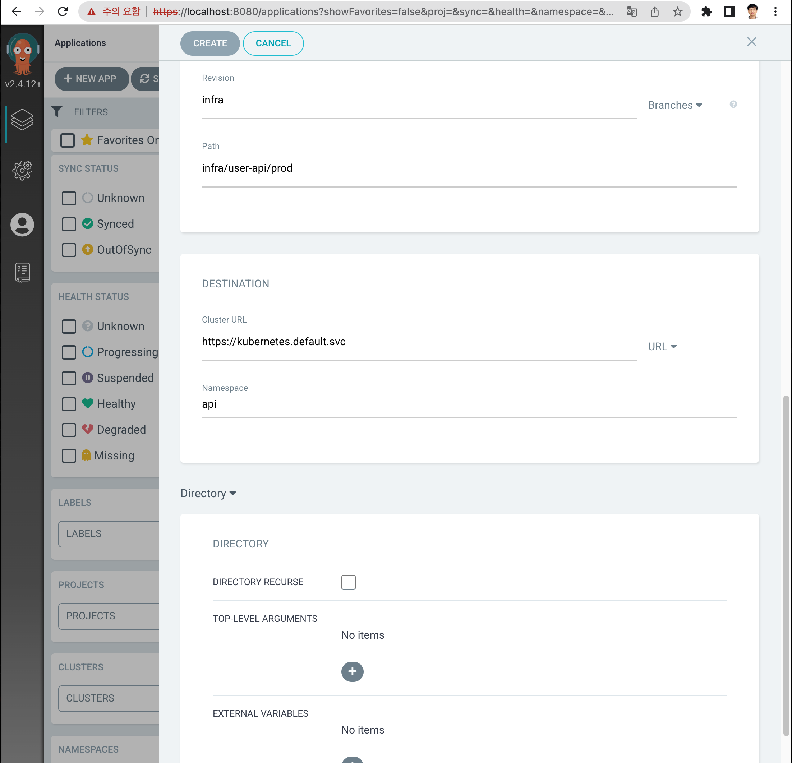
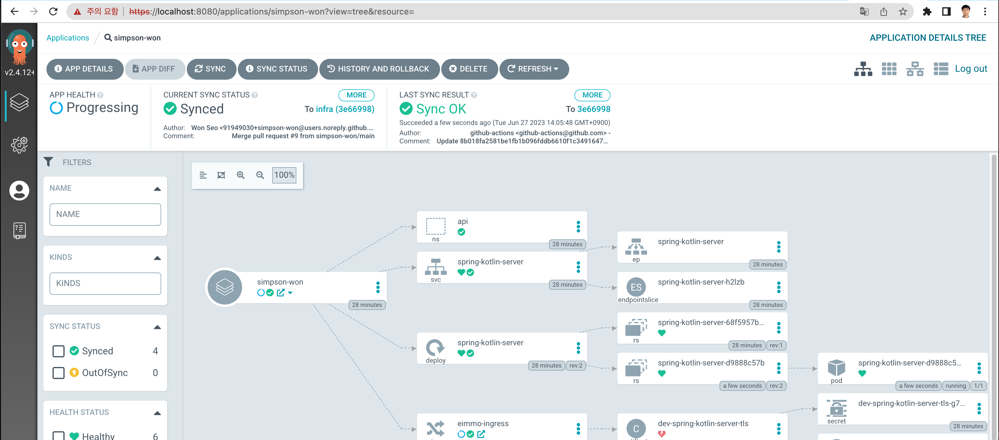

# spring-kotlin-server

# Compile

```
   mvn compile
   mvn package
```

# Run
+ Dev
```
   java -jar spring-kotlin-server-[version].jar --spring.profiles.active=dev 
```
+ Prod
```
   java -jar spring-kotlin-server-[version].jar --spring.profiles.active=dev 
```

# Docker
```
    docker build -t spring-kotlin-server:[version] .
```

# GitHub Setting
 - Create application account in azure active directory
 - Set ACR_ACCESS_PWD and ACR_ACCESS_ID using above information


# ArgoCD Setting
 - Create Application Project

 - Set project properties to access kubernetes url.

 - Create GitHub access Information


 - Create Project


 - Finally Completed


# Kubernetes Check
```agsl
aip-0164@aip-0164ui-MacBookPro ~ % kubectl get all -n api
NAME                                       READY   STATUS    RESTARTS   AGE
pod/cm-acme-http-solver-jbcvf              1/1     Running   0          30m
pod/spring-kotlin-server-d9888c57b-qhrnh   1/1     Running   0          3m20s

NAME                                TYPE       CLUSTER-IP     EXTERNAL-IP   PORT(S)          AGE
service/cm-acme-http-solver-5krmg   NodePort   10.0.79.85     <none>        8089:30951/TCP   30m
service/spring-kotlin-server        NodePort   10.0.190.133   <none>        8080:31068/TCP   30m

NAME                                   READY   UP-TO-DATE   AVAILABLE   AGE
deployment.apps/spring-kotlin-server   1/1     1            1           30m

NAME                                              DESIRED   CURRENT   READY   AGE
replicaset.apps/spring-kotlin-server-68f5957b46   0         0         0       30m
replicaset.apps/spring-kotlin-server-d9888c57b    1         1         1       3m21s
aip-0164@aip-0164ui-MacBookPro ~ %
```